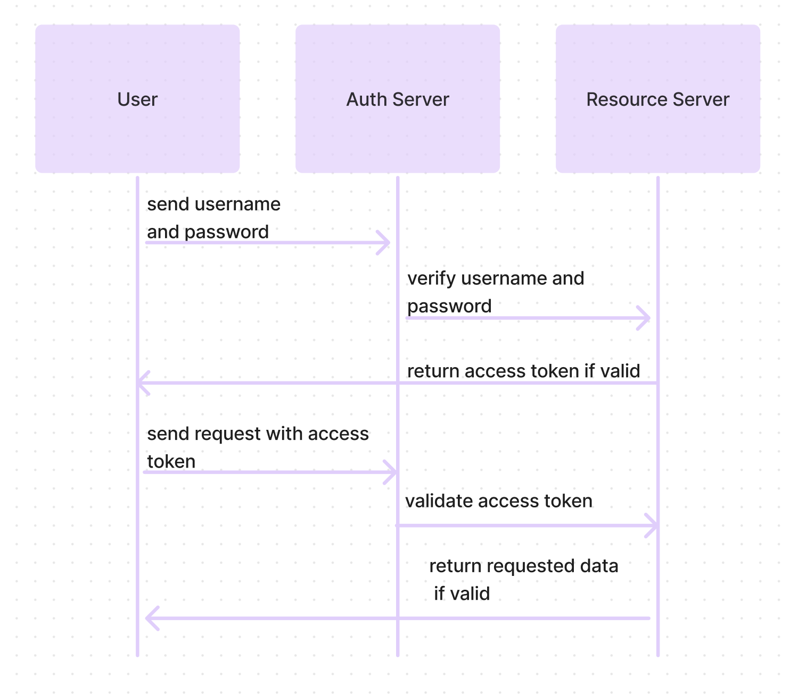

# LAB - Class 07

## Project: Bearer Authorization

### Author: Ezgi Coban

### Links and Resources

- [ci/cd](https://github.com/ezgi-c/basic-auth/actions/) (GitHub Actions)
- [back-end server url](http://xyz.com) (when applicable)
- [front-end application](http://xyz.com) (when applicable)

### Setup

#### `.env` requirements (where applicable)

- `DATABASE_URL` - postgres://localhost:5432/postgres
- `TOKEN_SECRET`

#### How to initialize/run your application (where applicable)

- `npm start`
- `npx nodemon src/index.js`

#### How to use your library (where applicable)

#### Tests

- How do you run tests?
    `npm test` , `npm run lint`
- Any tests of note?
    auth router test, model test
- Describe any tests that you did not complete, skipped, etc

#### UML

